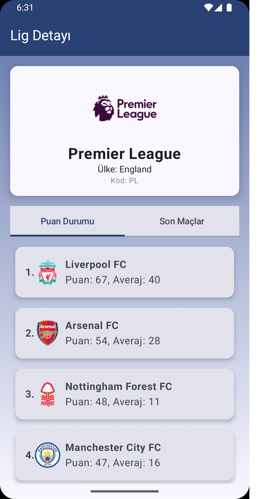
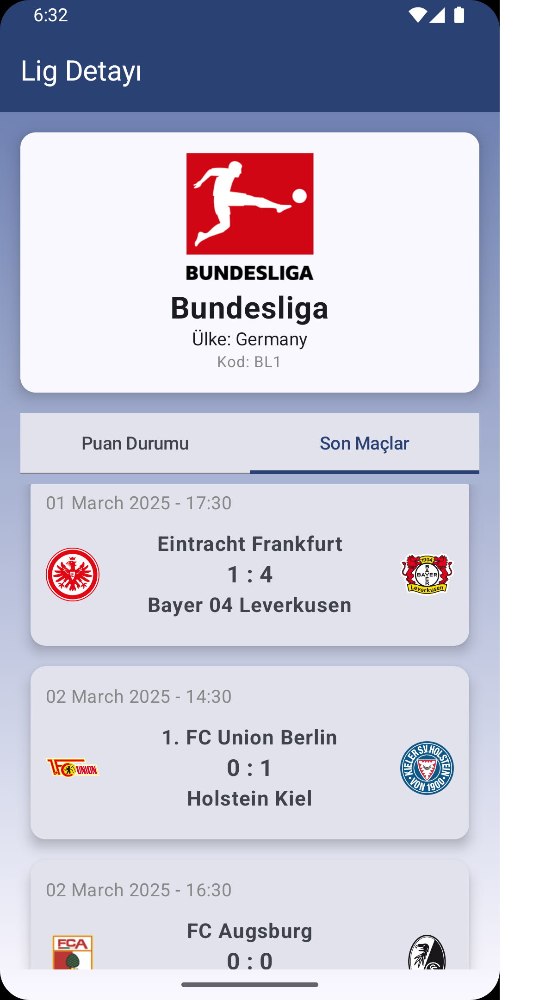
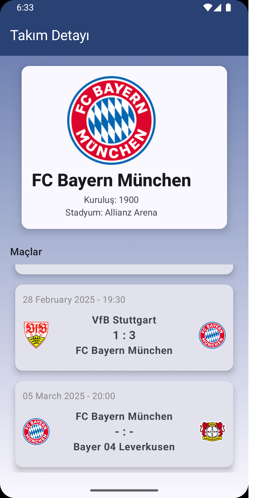

# 🏆 ScoreApp

ScoreApp, kullanıcıların canlı maç skorlarını takip edebileceği, geçmiş maç istatistiklerine ulaşabileceği ve favori takımlarını ekleyebileceği bir mobil uygulamadır.  

## 🚀 Kullanılan Teknolojiler
- Kotlin  
- Jetpack Compose  
- Retrofit (API ile veri çekme)  
- Glide
- MVVM Architecture  
- Flow  
- Hilt (Dependency Injection)  

## 📸 Ekran Görüntüleri  

<p align="center">
  
  
  
  
  
</p>

## 🔧 Kurulum  

1. Projeyi klonla:  
   ```bash
   git clone https://github.com/ahmetmuhittingrkn/ScoreApp.git
   
2. Android Studio ile aç.
3. https://www.football-data.org sitesinden api anahtarını al ve local.properties dosyasına ekle API_KEY="buraya_aldığın_api_key_yaz"
4. Gradle içinde api anahtarını çağırarak kullanabilirsiniz. val apiKey = BuildConfig.API_KEY


